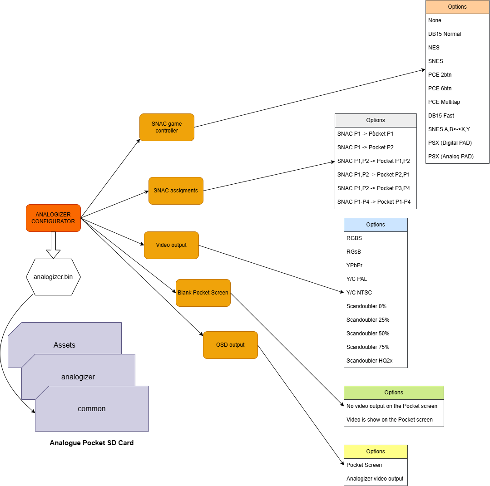

Analogizer Configurator
=======================
* Release 0.1 [31/01/2025]: initial release
* Release 0.2 [03/02/2025]: Simplified interface for a better user experience. Thanks for the suggestions to **@Denymetanol**
* Release 0.3 [04/02/2025]: Fixed an error that stores wrong value into analogizer.bin configuration file.

Utility for generating Analogizer configuration file for the Analogue Pocket FPGA game system.
Copy the generated `analogizer.bin` to `/Assets/analogizer/common` folder.
Install first some supported core as the Analogizer Amiga Core.
